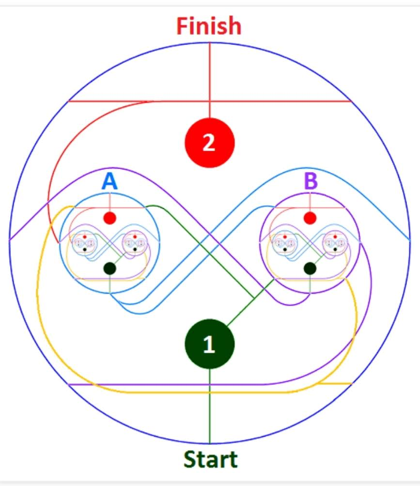
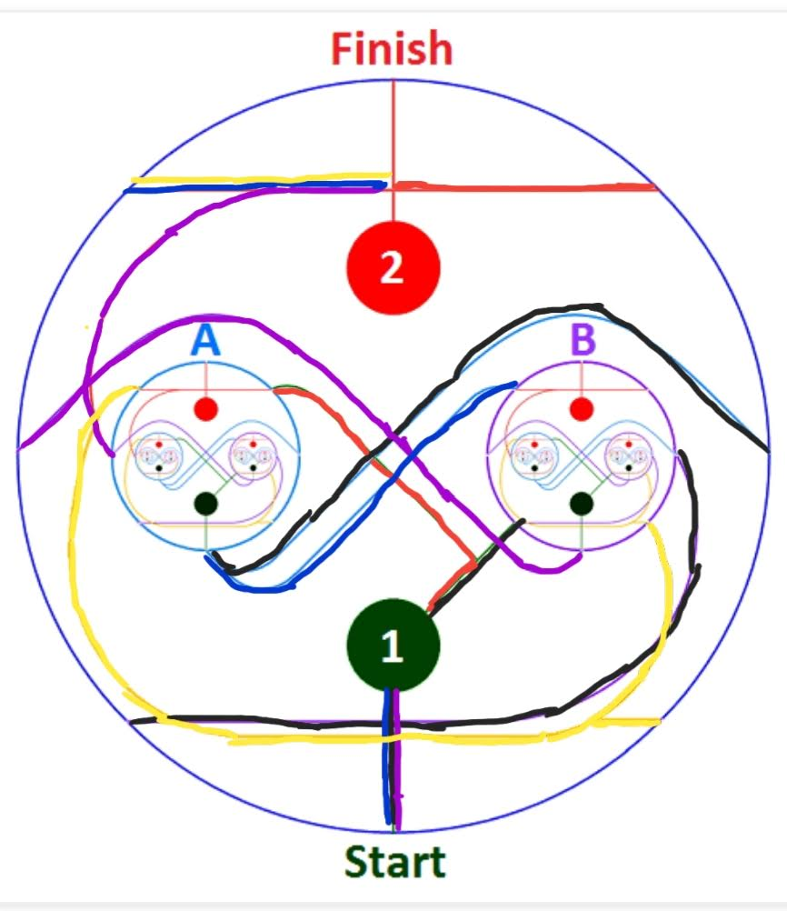
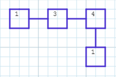
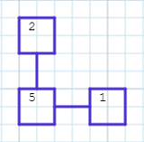
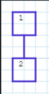
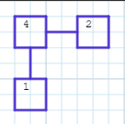
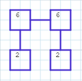
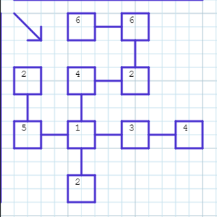
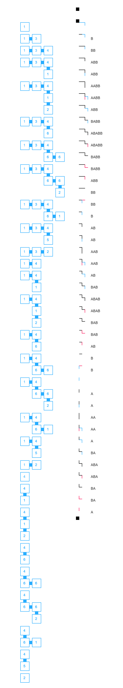
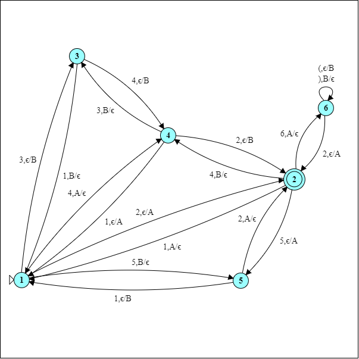

# Fractal Mazes to Push Down Automata

## Working Example



### Label Lines as int
- Green = 1
- Red = 2
- Bottom Purple = 3
- Blue = 4
- Top Purple = 5
- Yellow = 6
### Exact Transition List  
All line connections, append going in and out of fractal level
- 1 → A2
- 1 → B3
- A1 → 4
- B1 → 5
- B2 → 4
- 2 → A5
- A2 → 6
- 3 → B4
- 6 → B6
### Condensed Move List 
Use transition list to find all paths from 1 to 2
- Move 1: 1 → BBA1 (Black)
- Move 2: AB1 → 2 (Purple)
- Move 3: 1 → A2 (Red)
- Move 4: A1 → B2 (Blue)
- Move 5: A2 → BA2 (Yellow)

### Move Graphs
Show a graph representation of these moves
  - 1 → BBA1

  
  - AB1 → 2

  
  - 1 → A2
  
  
  - A1 → B2
  
  
  - A2 → BA2

  
    
### Move Set Graph
Start at 1, can only move right or down till you can go back



### Example Graph solution
Start at orgin point and get back with a different number at origin

    
### Text Solution
1. From Start → into B
2. Purple → into B
3. Blue → into A
4. Green → into A
5. Red → out of A
6. Yellow → into B
7. Yellow → into A
8. Red → out of A
9. Green → out of B
10. Purple → out of A
11. Red → out of B
12. Blue → into A
13. Green → into A
14. Red → out of A
15. Yellow → into B
16. Yellow → into A
17. Red → out of A
18. Green → out of B
19. Purple → out of A
20. Red → out of B
21. Blue → into A
22. Green → into A
23. Red → out of A
24. Yellow → into B
25. Yellow → into A
26. Red → out of A
27. Green → out of B
28. Purple → out of A
29. Red → out of B to Finish
### Pushdown Automation Version 
Machine = M = (K, Σ, Γ, Δ, s, F) where
  
- K = Finite State Set
- Σ = Finite Input Alphabet
- Γ = Finite Stack Alphabet
- Δ = Finite Subset of (K×(Σ∪{ε})×Γ*) × (K×Γ*) (Transition Relations)
- s ∈ K = Start State
- F ⊆ K = Final States 
```python
M = {
  'K': {1, 2, 3, 4, 5, 6},
  'Σ': {1, 2, 3, 4, 5, 6, '(', ')'},
  'Γ': {'A', 'B'},
  's': {1},
  'F': {2}
}  
```


[Online Editor](https://cs.odu.edu/~zeil/automat/automat.cgi?saved=1&saved=1&lang=eyJzcGVjaWZpY2F0aW9uIjoiYXV0b21hdG9uUERBIiwiY3JlYXRlZEJ5IjoiQW5vbnltb3VzIiwicHJvYmxlbUlEIjoiIiwidW5sb2NrxgxzdGF0ZXMiOlt7ImxhYmVsIjoiMSIsImluaXRpYWwiOnRydWUsImZpbsQNZmFsc2UsIngiOjIyLCJ5Ijo0NTZ9LMo6Msw6xy3HO8ZIeCI6NDc1xTsyODLMOzPaO8p2MTHGPDgwzDs03zvFOzI2OMZ3MTPMPDXfPMU8MzkwxTw0NTfMPDbfPMU8NTMzxTwxNjd9XSwidHJhbnNp5AG%2B5gF0ZnJvbecBc3Rv5wEHyGAzLEAvQiLEcscmxB3FJsQvyCYxLEIvQMwmyUzkAY7IJjIsQC9BzCbEHdNMQddM5AEoyCY10HLEHdNM7wC%2ByUzkAbDIJjTQcsQd1Uz2AL7uAJjPJukAmO4BCs9yyUzuAJjvAOTpAJjOTO8A5MlM5AIcyCY20HLEHdVM7QC%2BySbMTCjEclxuKfAAn%2BkCG%2B4Axe8An%2BkAxe4CZ8VMXX0%3D&saved=1)
    
Start: 1, Empty Stack

End 2, Empty Stack
    
Solution: 34126(21524126(21524126(2152